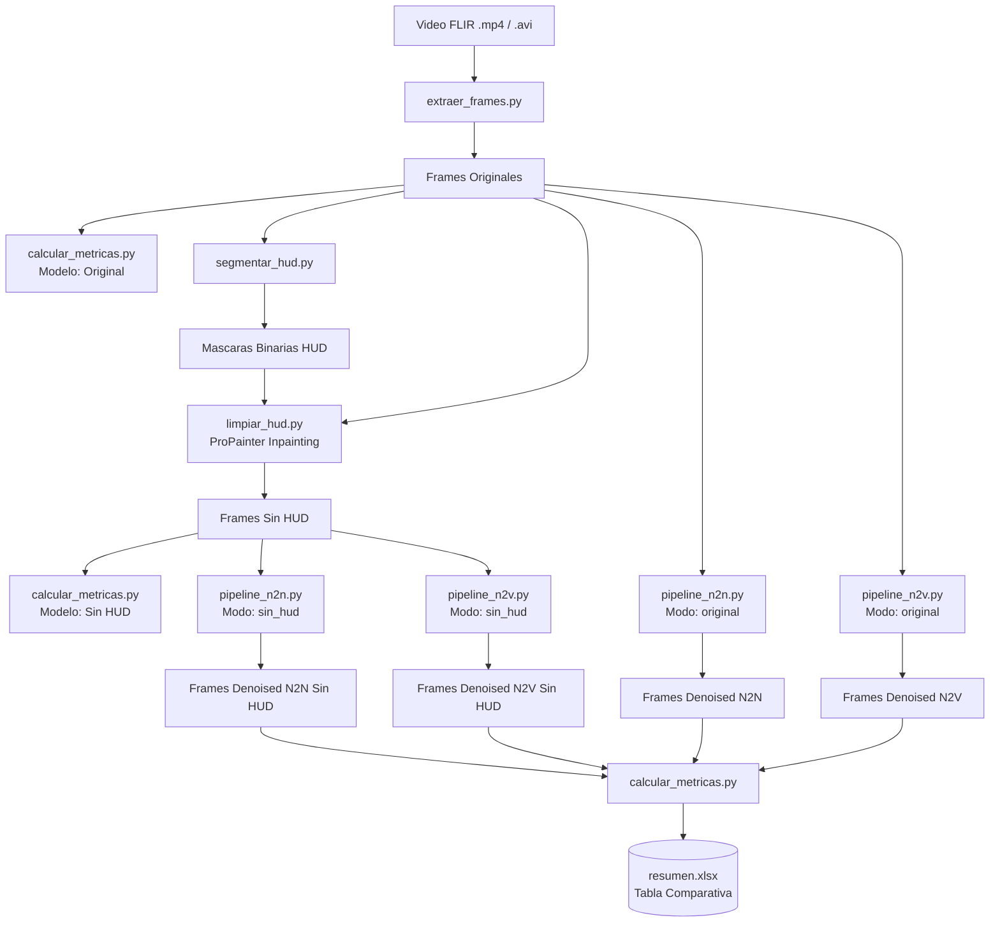

# Proyecto FAC: Pipeline de Preprocesamiento, Eliminacion de HUD y Denoising en Video FLIR

Pipeline modular y reproducible disenado para la restauracion y mejora de videos infrarrojos/termicos (FLIR) con telemetria HUD (Heads-Up Display), optimizado para ejecutarse en el cluster HPC Hypatia mediante el gestor de trabajos Slurm.

---

## Tabla de Contenidos
1. [Descripcion General](#descripcion-general)
2. [Arquitectura del Pipeline](#arquitectura-del-pipeline)
3. [Estructura del Repositorio](#estructura-del-repositorio)
4. [Configuracion Centralizada (config/videos.json)](#configuracion-centralizada-configvideosjson)
5. [Requisitos y Entorno](#requisitos-y-entorno)
6. [Flujo de Ejecucion en Slurm (Hypatia)](#flujo-de-ejecucion-en-slurm-hypatia)
   - [Fase 1: Preprocesamiento y Limpieza de HUD](#fase-1-preprocesamiento-y-limpieza-de-hud)
   - [Fase 2: Denoising (Noise2Noise y Noise2Void)](#fase-2-denoising-noise2noise-y-noise2void)
7. [Metricas de Calidad](#metricas-de-calidad)
8. [Comandos de Monitoreo y Utilidades](#comandos-de-monitoreo-y-utilidades)

---

## Descripcion General

Los videos infrarrojos tacticos y aereos presentan dos retos principales para el analisis visual y algoritmos posteriores:
1. **Presencia de HUD (Telemetria y Simbologia):** Textos, miras (crosshairs), brujulas y horizontes artificiales superpuestos que distorsionan las estadisticas de la imagen y los modelos de ruido.
2. **Ruido de Sensor Infrarrojo:** Ruido termico y estatico inherente a sensores FLIR donde no se dispone de ground truth (imagen limpia de referencia).

Este proyecto soluciona ambos retos mediante una secuencia automatizada:
* **Extraccion de fotogramas** de alta fidelidad.
* **Segmentacion morfologica y cromatica de HUD** mediante analisis espacial y temporal en espacio HSV.
* **Inpainting por video con ProPainter**, reconstruyendo la informacion ocluida con coherencia temporal y paralelismo multi-GPU.
* **Denoising autosupervisado** con la libreria **CAREamics**, implementando **Noise2Noise (N2N)** (usando parejas de fotogramas consecutivos con control de movimiento) y **Noise2Void (N2V / N2V2)** (red de punto ciego / blind-spot network).
* **Evaluacion de calidad de imagen sin referencia (NR-IQA)** mediante **NIQE** y **BRISQUE**.

---

## Arquitectura del Pipeline



---

## Estructura del Repositorio

```text
proyecto-FAC/
├── config/
│   ├── videos.json                   # Registro central de videos, parametros y estados
│   └── videos.lock                   # Control de concurrencia con flock para escrituras
├── scripts/
│   ├── extraer_frames.py             # Extraccion de fotogramas con OpenCV
│   ├── segmentar_hud.py              # Deteccion y generacion de mascaras de HUD (HSV + morfologia)
│   ├── limpiar_hud.py                # Inpainting espacio-temporal del HUD con ProPainter
│   ├── pipeline_n2n.py               # Pipeline CAREamics Noise2Noise (preparar, entrenar, inferir)
│   ├── pipeline_n2v.py               # Pipeline CAREamics Noise2Void (preparar, entrenar, inferir)
│   └── calcular_metricas.py          # Calculo de NIQE y BRISQUE (PyIQA) y exportacion a Excel
├── jobs/
│   ├── preprocesamiento.sbatch       # Job Slurm: extraccion -> metricas -> HUD -> inpainting -> metricas
│   ├── denoising_n2n_n2v.sbatch      # Job Slurm: N2N (GPU 0) y N2V (GPU 1) en paralelo + metricas
│   ├── logs/                         # Registros de salida (.out, .err, .log) generados en Slurm
│   └── comandos.txt                  # Comandos frecuentes para Hypatia
├── csv_logs/                         # Logs de entrenamiento de PyTorch Lightning / CAREamics
├── ProPainter/                       # Repositorio/modulo de ProPainter (ignorado por git)
├── videos/                           # Datos de trabajo (imagenes/videos ignorados por git)
│   └── video1/
│       ├── original/                 # Video crudo
│       ├── frames_originales/        # PNG extraidos
│       ├── mascaras_hud/             # Mascaras generadas
│       ├── frames_sin_hud/           # Frames reconstruidos con ProPainter
│       ├── n2n/                      # Resultados de N2N sobre original
│       ├── n2v/                      # Resultados de N2V sobre original
│       ├── n2n_sin_hud/              # Resultados de N2N sobre frames sin HUD
│       ├── n2v_sin_hud/              # Resultados de N2V sobre frames sin HUD
│       └── resumen.xlsx              # Matriz de metricas comparativas
├── main.ipynb                        # Notebook de analisis y prototipado
├── requirements.txt                  # Dependencias de Python
└── README.md                         # Documentacion del proyecto
```

---

## Configuracion Centralizada (config/videos.json)

Toda la informacion del dataset, metadatos, parametros y estado de ejecucion se centraliza en `config/videos.json`. Cada video registrado contiene:
* **`ruta`**: Ubicacion del archivo de video original.
* **`extraccion`**: Parametros de FPS, intervalo de tiempo, resolucion y estado.
* **`hud`**: Parametros de umbrales HSV, morfologia espacial y temporal, y parametros de ProPainter (`neighbor_length`, `subvideo_length`, etc.).
* **`modelos`**: Checkpoints de CAREamics, configuraciones generadas y rutas de inferencia para cada variante (`n2n`, `n2v`, `n2n_sin_hud`, `n2v_sin_hud`).

---

## Requisitos y Entorno

El entorno de ejecucion en Hypatia utiliza Python 3.11 (`fac_env311`) con soporte para PyTorch con CUDA, TorchVision, CAREamics 0.3.2, PyIQA, OpenCV y OpenPyXL.

### Activar entorno en sesion interactiva:
```bash
source fac_env311/bin/activate
```

### Ejecucion directa en scripts de Slurm:
Los scripts ejecutan el interprete directamente para evitar inconsistencias de `$PATH`:
```bash
/hpcfs/home/ing_sistemas/lf.martinezg1/proyecto-FAC/fac_env311/bin/python
```

---

## Flujo de Ejecucion en Slurm (Hypatia)

### Fase 1: Preprocesamiento y Limpieza de HUD
Ejecuta de manera secuencial e idempotente (omitiendo etapas ya verificadas):
1. Extraccion de frames.
2. Calculo de metricas sobre frames originales.
3. Segmentacion del HUD.
4. Eliminacion de HUD con ProPainter (distribuido en 2 GPUs).
5. Calculo de metricas sobre frames sin HUD.

```bash
sbatch jobs/preprocesamiento.sbatch video1
```

### Fase 2: Denoising (Noise2Noise y Noise2Void)
Entrena e infiere simultaneamente **N2N** (en la GPU logica 0) y **N2V** (en la GPU logica 1), y finaliza calculando sus metricas en `resumen.xlsx`:

```bash
# Para aplicar denoising sobre los frames originales:
sbatch jobs/denoising_n2n_n2v.sbatch video1 original

# Para aplicar denoising sobre los frames limpios (sin HUD):
sbatch jobs/denoising_n2n_n2v.sbatch video1 sin_hud
```

---

## Metricas de Calidad (NR-IQA)

Al no disponer de imagenes limpias de referencia (Ground Truth), se utilizan metricas de calidad sin referencia calculadas mediante **PyIQA**:
* **NIQE** (Natural Image Quality Evaluator): Mide la desviacion respecto a regularidades estadisticas de imagenes naturales. **Valores menores indican mejor calidad.**
* **BRISQUE** (Blind/Referenceless Image Spatial Quality Evaluator): Evalua distorsiones naturales en el dominio espacial. **Valores menores indican mejor calidad.**

Los resultados se consolidan automaticamente en `videos/<video_id>/resumen.xlsx` para comparar:
1. `Original`
2. `Sin HUD`
3. `Noise2Noise`
4. `Noise2Void`
5. `Noise2Noise sin HUD`
6. `Noise2Void sin HUD`

---

## Comandos de Monitoreo y Utilidades

### 1. Consultar estado de los nodos GPU en Hypatia:
```bash
sinfo -p gpu -N -o "%N | ESTADO=%T | CPU=%c | CPU(A/I/O/T)=%C | MEMORIA_MB=%m | GPU=%G"
```

### 2. Consultar trabajos en cola:
```bash
squeue -u $USER -o "%.18i %.12P %.24j %.12u %.2t %.10M %.4D %R"
```

### 3. Monitorear logs en tiempo real:
```bash
# Monitoreo de preprocesamiento
tail -n 100 -F jobs/logs/preprocesamiento_*_<JOB_ID>.out

# Monitoreo de denoising
tail -n 100 -F jobs/logs/n2n_video1_original_<JOB_ID>.log jobs/logs/n2v_video1_original_<JOB_ID>.log
```

### 4. Cancelar un trabajo:
```bash
scancel <JOB_ID>
```
