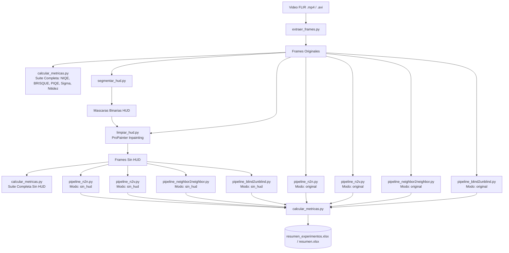

# Proyecto FAC: Pipeline de Preprocesamiento, Eliminacion de HUD y Denoising en Video FLIR

Pipeline modular y reproducible disenado para la restauracion y mejora de videos infrarrojos/termicos (FLIR) con telemetria HUD (Heads-Up Display), optimizado para ejecutarse en el cluster HPC Hypatia mediante el gestor de trabajos Slurm.

---

## Tabla de Contenidos
1. [Descripcion General](#descripcion-general)
2. [Arquitectura del Pipeline](#arquitectura-del-pipeline)
3. [Estructura del Repositorio](#estructura-del-repositorio)
4. [Modelos de Denoising Implementados](#modelos-de-denoising-implementados)
5. [Suite Completa de Metricas Sin Referencia](#suite-completa-de-metricas-sin-referencia)
6. [Búsqueda de Hiperparámetros y Experimentos (Grid Search)](#busqueda-de-hiperparametros-y-experimentos-grid-search)
7. [Flujo de Ejecucion en Slurm (Hypatia)](#flujo-de-ejecucion-en-slurm-hypatia)
8. [Comandos de Monitoreo y Utilidades](#comandos-de-monitoreo-y-utilidades)

---

## Descripcion General

Los videos infrarrojos tacticos y aereos presentan dos retos principales para el analisis visual:
1. **Presencia de HUD (Telemetria y Simbologia):** Textos, miras (crosshairs), brujulas y horizontes artificiales superpuestos que distorsionan las estadisticas de la imagen y los modelos de ruido.
2. **Ruido de Sensor Infrarrojo:** Ruido termico y estatico inherente a sensores FLIR donde no se dispone de ground truth (imagen limpia de referencia).

Este proyecto aborda ambos retos mediante:
* **Extraccion de fotogramas** de alta fidelidad.
* **Segmentacion morfologica y cromatica de HUD** (HSV + analisis temporal).
* **Inpainting por video con ProPainter** distribuido en multi-GPU.
* **Denoising autosupervisado / Zero-Shot** evaluando 4 paradigmas 2D de la literatura:
  * **Noise2Noise (N2N)** con filtrado de movimiento de pares consecutivos.
  * **Noise2Void (N2V / N2V2 / StructN2V)** para ruido isotropico y en franjas.
  * **Neighbor2Neighbor** (CVPR 2021) mediante submuestreo de vecinos locales.
  * **Blind2Unblind** (CVPR 2022) mediante mascaras de visibilidad estructuradas.
* **Evaluacion exhaustiva sin referencia**: NIQE, BRISQUE, PIQE, estimacion de sigma de ruido ($\sigma$), nitidez laplaciana y retencion de bordes.

---

## Arquitectura del Pipeline



---

## Estructura del Repositorio

```text
proyecto-FAC/
├── config/
│   ├── videos.json                        # Registro central de videos, parametros y estados
│   └── videos.lock                        # Control de concurrencia con flock para escrituras
├── scripts/
│   ├── extraer_frames.py                  # Extraccion de fotogramas con OpenCV
│   ├── segmentar_hud.py                   # Deteccion y generacion de mascaras de HUD
│   ├── limpiar_hud.py                     # Inpainting espacio-temporal con ProPainter
│   ├── pipeline_n2n.py                    # Noise2Noise con filtrado de movimiento
│   ├── pipeline_n2v.py                    # Noise2Void (N2V / N2V2 / StructN2V)
│   ├── pipeline_neighbor2neighbor.py      # Neighbor2Neighbor (CVPR 2021)
│   ├── pipeline_blind2unblind.py          # Blind2Unblind (CVPR 2022)
│   └── calcular_metricas.py               # Suite completa NR-IQA (NIQE, BRISQUE, PIQE, Sigma, Nitidez)
├── jobs/
│   ├── grid_search_experimentos.sbatch    # Grid Search automatico de 1000 frames
│   ├── preprocesamiento.sbatch            # Preprocesamiento e inpainting
│   ├── denoising_n2n_n2v.sbatch           # Denoising en paralelo
│   └── logs/                              # Registros de salida de Slurm
├── videos/                                # Datos y reportes (imagenes ignoradas por git)
│   └── video1/
│       ├── resumen.xlsx                   # Resumen consolidado final
│       └── resumen_experimentos.xlsx      # Matriz de comparacion de hiperparametros
└── README.md
```

---

## Modelos de Denoising Implementados

1. **Noise2Noise (N2N):**
   * Utiliza pares de fotogramas consecutivos $(t, t+1)$.
   * Incluye **filtrado de movimiento** mediante flujo óptico Farneback para descartar giros bruscos de cámara y evitar que la red aprenda la identidad.
2. **Noise2Void (N2V / N2V2 / StructN2V):**
   * Red de punto ciego (*blind-spot*). Soporta **N2V2** (interpolación suave local) y **StructN2V** (enmascaramiento horizontal para eliminar *striping* en FLIR).
3. **Neighbor2Neighbor (CVPR 2021):**
   * Genera subpares de entrenamiento a partir de una única imagen mediante un muestreador de celdas $2\times 2$ y regularización de varianza.
4. **Blind2Unblind (CVPR 2022):**
   * Utiliza una máscara de visibilidad estructurada y pérdida de consistencia para preservar bordes finos.

---

## Suite Completa de Metricas Sin Referencia

Al no disponer de imagen limpia de referencia (*Ground Truth*), se calcula un conjunto balanceado de métricas:
* **NIQE (↓) y BRISQUE (↓):** Calidad estadística espacial natural.
* **PIQE (↓):** Evaluación perceptual enfocada en artefactos de bloque y distorsiones locales.
* **Sigma de Ruido $\sigma_{\text{ruido}}$ (↓):** Estimación directa de la desviación estándar del ruido en altas frecuencias mediante *Median Absolute Deviation* (MAD).
* **Nitidez Laplaciana y Retención de Nitidez:** Varianza del Laplaciano respecto al fotograma original para asegurar que el modelo no esté aplicando un desenfoque excesivo.

---

## Busqueda de Hiperparametros y Experimentos (Grid Search)

Para comparar y optimizar todas las arquitecturas en un subconjunto de **1,000 frames** antes de procesar el video completo, ejecuta:

```bash
sbatch jobs/grid_search_experimentos.sbatch video1 1000 15 300
```

Este job evalúa de manera automática:
* N2N con filtrado estricto vs sin filtro.
* N2N con tasas de aprendizaje $10^{-4}$, $3\cdot 10^{-4}$, $10^{-3}$ y profundidades 3 vs 4.
* N2V clásico vs N2V2 vs StructN2V (horizontal).
* Neighbor2Neighbor y Blind2Unblind.
* El impacto del orden: Denoising sobre original vs Denoising sobre frames sin HUD.
* Consolida toda la tabla comparativa con métricas en `videos/video1/resumen_experimentos.xlsx`.

---

## Comandos de Monitoreo y Utilidades

### Consultar estado de trabajos en Hypatia:
```bash
squeue -u $USER -o "%.18i %.12P %.24j %.12u %.2t %.10M %.4D %R"
```

### Monitorear el Grid Search en tiempo real:
```bash
tail -n 100 -F jobs/logs/grid_search_*.out
```
